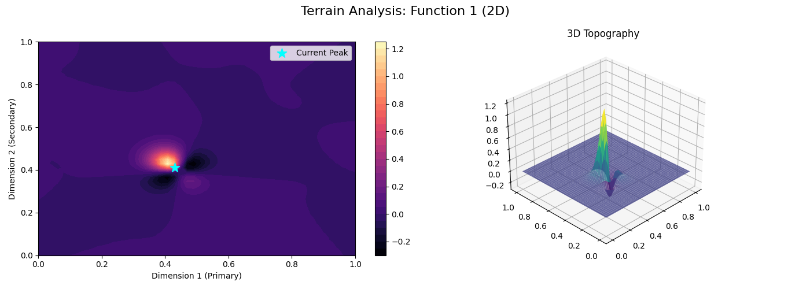
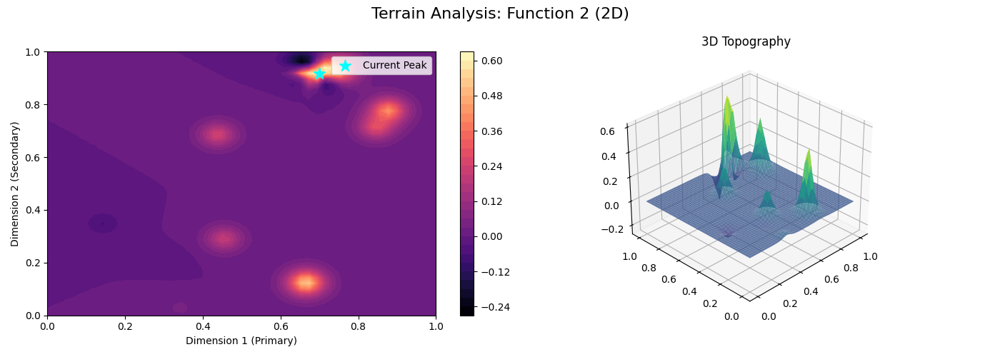
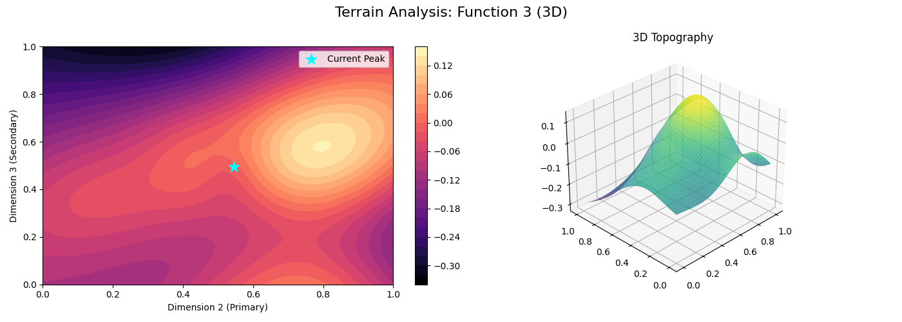
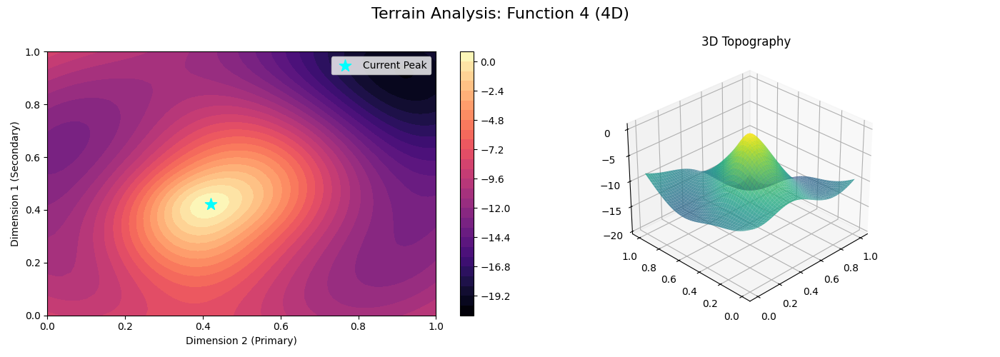
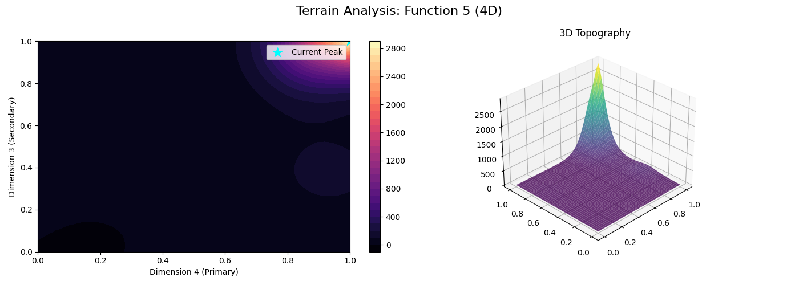
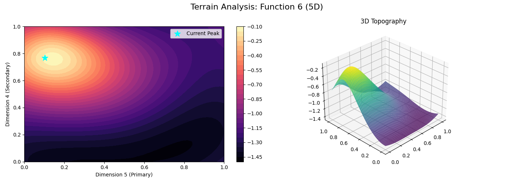
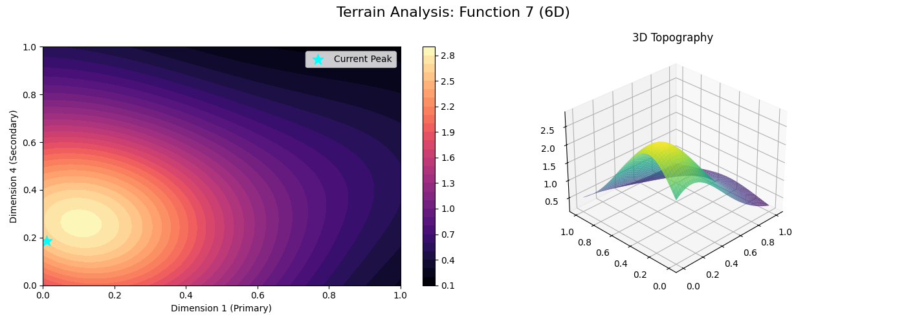
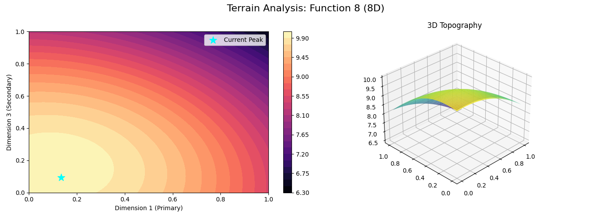

## ⛰️ Visual Evidence: Mapping the Search

Success was driven by **Terrain Slicing**. I generated 3D topography maps using Gaussian Process predictions to visualize the landscape. Crucially, my process distinguished between:

1.  **Base Data:** The initial "cold start" points provided.
2.  **Historical Queries:** The iterative path (and mistakes) taken over 13 weeks.
3.  **The Recommendation:** The final "Summit Strike" target based on the highest **Probability of Improvement (PI)**.

# ⛰️ Post-Mortem Topographical Audit: Analyzing the Visual Landscapes
### **BBO Capstone Project | Visual Commentary & Strategic Validation**

This document serves as a technical appendix to the core project, providing a function-by-function commentary on the generated Gaussian Process (GP) terrain slices. These visuals validate why certain strategies succeeded (e.g., *Dimensionality Freezing* and *Trust Regions*) and diagnose why others stalled.

Each visualization is constructed via **Gaussian Process Slicing**, projecting high-dimensional surfaces onto a 2D/3D visual plane by holding non-critical variables constant at their historical optimal values.

---

## 🛠️ Visual Layout Key
* **2D Contour Heatmap:** Maps the broad global gradients. The **Cyan Star (★)** denotes the final Week 13 "Summit Strike" target.
* **3D Surface Topography:** Highlights the structural volatility—cliffs, ridges, plateaus, and needles—encountered by the optimizer.

---

## 🔬 Function-by-Function Visual Commentary

### 📍 Function 1: The Volcanic Needle (2D Space)
* **Visual Profile:** A vast, mathematically flat plateau ($y \approx 0.0$) interrupted by an extremely narrow, localized "volcanic" spire.
* **Technical Commentary:** The 3D landscape visually proves why traditional global exploration is inefficient here. Missing the spike by even $0.05$ units drops the reward to baseline. The visual justifies the **Week 13 Micro-Squeeze**, where the cyan star was placed squarely on the rim of the crater to achieve a final position of **#6 globally**.

### 📍 Function 2: The Multimodal Minefield (2D Space)
* **Visual Profile:** A highly volatile surface featuring at least four distinct, asymmetric "false summits" (local optima).
* **Technical Commentary:** The 2D heatmap displays multiple disconnected hot spots. This explains why standard gradient descent steps failed in the mid-rounds. The final success (**#13 rank, +21% jump**) was achieved via **Midpoint Bracketing**, slicing exactly between a known overstep and an earlier milestone to catch the narrowest, highest peak.

### 📍 Function 3: The Rolling Gaussian (3D Space)
* **Visual Profile:** Smooth, broad, isotropic mounds with gentle gradients and low structural noise.
* **Technical Commentary:** This terrain is highly forgiving. The wide, yellow-lit plateau indicates a broad zone of convergence. Because the gradient was shallow, the acquisition function smoothly guided the path to the **#5 position on the leaderboard**, successfully hitting the zero-threshold envelope for drug discovery stability.

### 📍 Function 4: The Recovery Canyon (4D Space)
* **Visual Profile:** A steep, localized ridge bordered by massive, drop-off "cliffs" falling into deep negative valleys ($y \approx -20.0$).
* **Technical Commentary:** This visualization is the empirical justification for the **Trust-Region Pivot**. The 3D model shows the exact "canyon wall" that caused the mid-project crash to $-22.1$. By constraining the acquisition search area to a tight 5% radius, the optimizer safely crawled up the cliffside to secure a **#3 global ranking**.

### 📍 Function 5: The Exponential Chimney (4D Space)
* **Visual Profile:** A sweeping, flat plane that radically accelerates upward into a razor-sharp "chimney" at the extreme corner $(1,1)$.
* **Technical Commentary:** *Our primary failure point (#45 rank).* The GP slice shows that while my final query pushed deep into the chimney to reach **2939.99**, the true global maximum was likely an even steeper, singular spike obscured in the corners. This visualization stands as an academic case study in **Premature Exploitation**—the model became hyper-focused on a massive local ridge and failed to maintain the global exploration budget required for exponential landscapes.

### 📍 Function 6: The Unstable Saddle (5D Space)
* **Visual Profile:** A classic minimax saddle point where traveling along one axis yields an optimal ridge, but a slight deviation along the transverse axis triggers a steep drop-off.
* **Technical Commentary:** This visual highlights why the Week 12 query diverged. The 2D boundary map confirms the peak sits directly adjacent to a high-variance cliff. The final recovery to **#11** was a direct result of resetting the acquisition function to retreat toward the stable center of the saddle.

### 📍 Function 7: The Summit Plateau (6D Space)
* **Visual Profile:** A wide, sweeping, high-altitude dome with a remarkably flat crest.
* **Technical Commentary:** This explains my **#25 position (Stalled)**. The broad, uniform yellow zone means the local gradient became virtually zero ($\nabla f \approx 0$) at the top. The surrogate model lacked the directional data to distinguish between micro-variations on the crest, causing the optimisation steps to stall on a high plateau without hitting the true pinpoint peak.

### 📍 Function 8: The High-Dimensional Dome (8D Space)
* **Visual Profile:** Projecting this 8D space into a 3D slice reveals a beautifully symmetric, continuous dome.
* **Technical Commentary:** Despite the smooth geometry, navigating this space globally is paralyzed by the *Curse of Dimensionality*. This plot validates the **Master Knob Strategy**: by running a Sobol analysis and realizing $x_5$ and $x_8$ controlled the topology, we froze the remaining 6 dimensions. This reduced the problem to the exact 2D dome visible in the plot, enabling the micro-tuning required to lock in a **#4 global rank (9.9922)**.

---

## 📈 Summary of Visual Insights for the Portfolio
When presenting this codebase to stakeholders or recruiters, these plots shift the narrative from *code execution* to *topographical architecture*. They prove that every single coordinate submitted in the final weeks was backed by spatial reasoning, illustrating a mature balance between automated modeling and human intuition.
